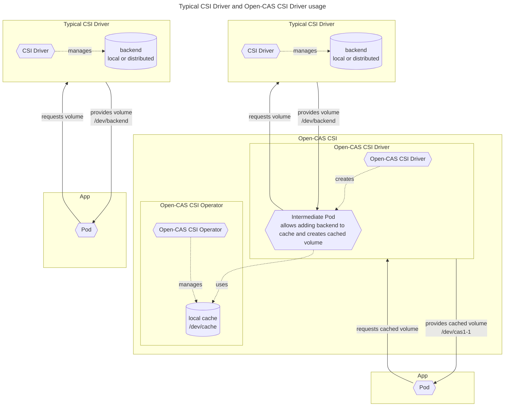

# Open-CAS CSI

- [Open-CAS CSI](#open-cas-csi)
  
  ---
  - [Description](#description)
    - [Open-CAS CSI Operator](#open-cas-csi-operator)
      - [DriverInstance custom resource](#driverinstance-custom-resource)
      - [Cache custom resource](#cache-custom-resource)
    - [Open-CAS CSI Driver](#open-cas-csi-driver)
  ---
  - [Installation](#installation)  
    - [1. Pre-requisites](#1-pre-requisites)
      - [a) cert-manager](#a-cert-manager)
      - [b) [recommended] Kernel Module Management Operator (release-1.1)](#b-recommended-kernel-module-management-operator-release-11)
        - [Installation using operator-sdk](#installation-using-operator-sdk)
        - [Installation using make](#installation-using-make)
        - [Kernel module setup](#kernel-module-setup)
        - [[alternative] Manually install Open-CAS on nodes](#alternative-manually-install-open-cas-on-nodes)
      - [c) Prepare `casadm` binary image](#d-prepare-casadm-binary-image)
      - [d) Prepare Open-CAS CSI images](#e-prepare-open-cas-csi-images)
        - [Open-CAS CSI Driver image](#open-cas-csi-driver-image)
        - [Open-CAS CSI Operator image](#open-cas-csi-operator-image)
        - [[recommended] Open-CAS CSI Webhookserver image](#recommended-open-cas-csi-webhookserver-image)
    - [2. Deployment using Open-CAS CSI Operator](#2-deployment-using-open-cas-csi-operator)
      - [a) Deploy Operator](#a-deploy-operator)
      - [b) Configure DriverInstance](#b-configure-driverinstance)
  ---
  - [Usage](#usage)
    - [1. Cache setup](#1-cache-setup)
      - [Using Operator (recommended)](#using-operator-recommended)
      - [Without operator (possible alternative, but not recommended)](#without-operator-possible-alternative-but-not-recommended)
    - [2. Identify or create a StorageClass for your backend with a "regular" CSI Driver as a provisioner](#2-identify-or-create-a-storageclass-for-your-backend-with-a-regular-csi-driver-as-a-provisioner)
    - [3. Create an Open-CAS CSI ("cached") StorageClass that references the "regular" StorageClass](#3-create-an-open-cas-csi-cached-storageclass-that-references-the-regular-storageclass)
    - [4. Create a PVC for the "cached" StorageClass](#4-create-a-pvc-for-the-cached-storageclass)
    - [5. Reference the "cached" PVC in your App](#5-reference-the-cached-pvc-in-your-app)
    - [6. Apply your application configuration](#6-apply-your-application-configuration)

---

## Description

The Open-CAS CSI project contains a CSI Driver along with an Operator to enable Container Orchestrators to manage the lifecycle of cached volumes.  
A cached volume comprises of a local cache device (on the node where a pod is scheduled) and a backend (a block device) provided by your typical CSI Driver (local or distributed storage).  

The Open-CAS CSI Driver is **NOT** a standalone CSI Driver. It adds caching between the Application that requests a Persistent Volume and the CSI Driver that provisions it. In the process the Open-CAS CSI Driver combines the Persistent Volume and a cache, and provisions the resulting cached Persistent Volume to the Application. No modifications to the base CSI Driver are needed, but this Driver has to be able to provision block volumes.

[Open-CAS Linux](https://github.com/Open-CAS/open-cas-linux) is the software that provides caching capabilities and is the very foundation for this solution.

The diagram below shows simplified workflows with and without Open-CAS CSI:



### Open-CAS CSI Operator

The Operator manages Open-CAS CSI Driver deployments and configures local caches on nodes. There are Custom Resource Definitions (CRDs) installed along with the Operator to help with those tasks. Follow [Installation instructions](#installation) to deploy the Operator.

#### DriverInstance custom resource

An Open-CAS CSI Driver deployment is managed using a DriverInstance CR. DriverInstance contains necessary configuration that allows for proper Driver setup. Once the DriverInstance resource is created, the Operator manages all the necessary resources and roles for the Driver and monitors them for changes.  
Deleting a DriverInstance resource results in the Open-CAS CSI Driver removal.  
Example [DriverInstance configuration](#b-configure-driverinstance) is provided in the [Installation](#installation) section.

#### Cache custom resource

Local caches are configured using Cache CRs. The name of the Cache resource reflects the name of the node, where a local cache is to be configured (one Cache resource per node). The Cache resource contains the information which block devices are to be used as a local cache and the desired cache structure. The Operator creates local caches according to the configuration in Cache resources, reconfigures caches after detecting Cache resource changes, and restores a cache after its node restart.  
Removing a Cache resource stops the corresponding local cache instance.  
Open-CAS CSI Driver cannot provision cached volumes on nodes without a pre-configured cache.  
Example [Cache configuration](#using-operator-recommended) is provided in the [Usage](#usage) section.

**NOTICE:** While Open-CAS supports a range of cache modes, the modes that allow for dirty data on cache are by default not configurable for data safety. In case of a node failure the data not flushed to a backend might be unrecoverable, and if the application is rescheduled to another node then backend will contain old data. Therefore those modes are not accepted in the Cache custom resource. The Cache CRD can be modified to accept those cache modes, but it is **NOT RECOMMENDED**. **BE WARNED** that doing this requires consideration if data loss is acceptable - when node comes back up its configured Cache is started with `--force` flag (cached data is removed).

### Open-CAS CSI Driver

The Driver allows for dynamic provisioning of cached volumes to applications. Instead of requesting a backend storage directly from a StorageClass assigned to a typical CSI provisioner, an application can request backend from an Open-CAS CSI StorageClass that references the aforementioned backend StorageClass.  
When PVCs referencing an Open-CAS CSI StorageClass are used in an application and a Pod with a cached volume is scheduled to a node, the Driver first requests backend from the referenced StorageClass, adds this backend to the [preconfigured local cache](#1-cache-setup), and finally provisions the resulting cached volume to the Pod.  
More details can be found in the [Usage](#usage) section.

The Open-CAS CSI Driver follows a standard controller-node CSI Driver structure.  
The controller component is usually deployed on the control-plane node(s). Its main task is to ensure that on receiving a request from a scheduled application Pod an initial cached PersistentVolume resource is created and the backend for the cached volume is requested on the same node where the Pod is scheduled.  
The node component is deployed on all selected nodes. It takes over after the backend requested by the controller is provisioned by the backend CSI Driver. Then this backend is connected to the preconfigured cache and the resulting cached volume is prepared and served to the application Pod.

---

## Installation

You can use the included [installation script](deploy/install.sh) which requires configuration PARAMS. The full list of PARAMS with their default values (where applicable) is contained in install.sh header.  
It is **HIGHLY RECOMMENDED** to familiarize yourself with the contents of the [script](deploy/install.sh), the list of PARAMS, and the Module definition contained in [kmmo-opencas-module.yaml](deploy/kmmo-opencas-module.yaml) before running the script.  

This script is intended for k8s and:

- deploys pre-requisites - cert-manager and KMM Operator (if not already deployed),
- deploys Open-CAS kernel module using KMM Operator (if not already deployed),
- creates images for Open-CAS CSI components - casadm binary, Driver, Operator, Webhook server (if not present),
- deploys Open-CAS CSI Driver.

The install script and KMM Operator will use the sources from [Open-CAS Linux repo](https://github.com/Open-CAS/open-cas-linux) to build kernel module and casadm binary.  
The default node-selector for Open-CAS Module and Open-CAS CSI Driver is `node-role.kubernetes.io/worker: ""`. If you want to set a different one then pass `SELECTOR='key: value'` parameter when running the script.  

```shell
cd deploy; chmod +x install.sh; <PARAMS> ./install.sh
```

If you prefer a semi-manual installation then follow the instructions below.

### 1. Pre-requisites

#### a) cert-manager

```shell
kubectl apply -f https://github.com/cert-manager/cert-manager/releases/download/<version>/cert-manager.yaml
kubectl -n cert-manager wait --for=condition=Available deployment \
 cert-manager \
 cert-manager-cainjector \
 cert-manager-webhook
```

#### b) [recommended] Kernel Module Management Operator (release-1.1)

Automated kernel module in-cluster building and deployment for selected nodes.

The Open-CAS kernel module is built against a specific kernel version. Therefore if there are nodes with different kernel versions, then KMMO simplifies management by building images with kernel module for each kernel version within selected nodes. What's more, KMMO is able to detect kernel version changes on nodes and re-build Open-CAS kernel module if necessary.

More information about the KMM Operator can be found on [KMMO website](https://kmm.sigs.k8s.io/).

KMMO is under active development and there are many changes between versions. Version 1.1 was used for preparing Open-CAS kernel module deployment - newer versions might have changes that need modifications to the Module definition.

##### Installation using operator-sdk

```shell
operator-sdk run bundle gcr.io/k8s-staging-kmm/kernel-module-management-operator-bundle:v20230606-v1.1.0
```

##### Installation using make

Makefile for KMMO does not include configurable KUBECTL and CONTAINER_TOOL (the defaults are `kubectl` and `docker`). If non-default values are required, edit the Makefile before running `make deploy`.

```shell
git clone https://github.com/kubernetes-sigs/kernel-module-management.git
cd kernel-module-management
git checkout release-1.1
make deploy IMAGE_TAG=v20230606-v1.1.0
```

##### Kernel module setup

The KMMO requires an access from the cluster to a registry to store built images, **insecure registries require additional configuration** both on nodes and in the Module CR.

Example Open-CAS Module resource for KMMO, which uses Open-CAS Linux sources from github repository:

```yaml
apiVersion: v1
kind: Namespace
metadata:
  name: opencas-module
---
apiVersion: v1
kind: ConfigMap
metadata:
  name: opencas-module-dockerfile
  namespace : opencas-module
data:
  dockerfile: |
    FROM ubuntu as builder

    ARG KERNEL_VERSION

    RUN apt-get update && \
        apt-get install -y \
        make \
        gcc \
        git \
        linux-headers-${KERNEL_VERSION} \
        python3
    
    RUN git clone --depth=1 --branch ${VERSION} https://github.com/Open-CAS/open-cas-linux.git \
        || git clone https://github.com/Open-CAS/open-cas-linux.git && cd open-cas-linux && git checkout ${VERSION}

    WORKDIR /open-cas-linux
    RUN git submodule update --init ocf

    RUN sed -i 's/utils//g' Makefile \
        && sed -i 's/^.*MODPROBE.*$//g' modules/Makefile

    RUN ./configure
    RUN make -j

    FROM ubuntu

    ARG KERNEL_VERSION

    RUN apt-get update && apt-get install -y kmod

    COPY --from=builder /open-cas-linux/modules/cas_cache/cas_cache.ko /opt/lib/modules/${KERNEL_VERSION}/extra/block/opencas/
    COPY --from=builder /open-cas-linux/casadm/casadm /usr/sbin/casadm

    RUN depmod -b /opt ${KERNEL_VERSION}
---
apiVersion: kmm.sigs.x-k8s.io/v1beta1
kind: Module
metadata:
  name: opencas-module
  namespace: opencas-module
spec:
  moduleLoader:
    container:
      modprobe:
        moduleName: cas_cache  # Required
      imagePullPolicy: Always  # Optional
      kernelMappings:  # At least one item is required
        # For any kernel, build the image using the Dockerfile in the ConfigMap.
        - regexp: '^.+$'
          containerImage: "<registry>/opencas-module:${KERNEL_FULL_VERSION}" # Ready image will be uploaded and accessible in this location
          build:
            buildArgs:  # Optional arguments passed to build environment, e.g. proxy
              - name: VERSION
                value: "v24.9"
              #- name: ARG_NAME
              #  value: arg_value
            #secrets:  # Optional
            #  - name: some-kubernetes-secret  # Will be available in the build environment at /run/secrets/some-kubernetes-secret.
            #baseImageRegistryTLS:
              # Optional and not recommended! If true, the build will be allowed to pull the image in the Dockerfile's
              # FROM instruction using plain HTTP.
              #insecure: false
              # Optional and not recommended! If true, the build will skip any TLS server certificate validation when
              # pulling the image in the Dockerfile's FROM instruction using plain HTTP.
              #insecureSkipTLSVerify: false
            dockerfileConfigMap:  # Required
              name: opencas-module-dockerfile
          #registryTLS:
            # Optional and not recommended! If true, KMM will be allowed to check if the container image already exists
            # using plain HTTP.
            #insecure: false
            # Optional and not recommended! If true, KMM will skip any TLS server certificate validation when checking if
            # the container image already exists.
            #insecureSkipTLSVerify: false
  selector:
    node-role.kubernetes.io/worker: "" # kernel module will be built/deployed for the selected nodes
```

Detailed Module CRD description is available at [KMMO website](https://kmm.sigs.k8s.io/documentation/deploy_kmod/#module-crd).

After applying the configuration, KMMO will build kernel module images and run module-containers on each selected node. The containers will load `cas_cache` kernel module on start and unload it before termination.

##### [alternative] Manually install Open-CAS on nodes

An alternative to recommended [KMM Operator](#b-recommended-kernel-module-management-operator-release-11), may be useful for testing purposes. Install individually on all selected nodes using Open-CAS Linux [installation guide](https://github.com/Open-CAS/open-cas-linux?tab=readme-ov-file#installation).

#### d) Prepare `casadm` binary image

`casadm` is a management binary, independent from kernel version and unchanged for specific minor version of Open-CAS (for example `casadm` for all v24.09.x versions remains the same). The Open-CAS CSI driver utilizes the contenerized binary to manage cached volumes.

The binary image can be built using the [Dockerfile.casadm](deploy/Dockerfile.casadm) contained in the deploy directory.

The casadm container image can be used to manually issue commands directly on nodes (if the kernel module is loaded on a given node). It has to be run in the privileged mode and have certain volumes attached to work correctly with CSI driver.  
Handy alias:

```bash
alias casadm="docker run --privileged -v /dev:/dev -v <kubelet_dir>:<kubelet_dir> <casadm_image> casadm"
```

#### e) Prepare Open-CAS CSI images

##### Open-CAS CSI Driver image

Use make with proper parameters:

```shell
# you can set variables in pkg/csi-driver/Makefile, directly in command, or pre-export them - for example for microk8s:
# export KUBECTL="microk8s.kubectl"
cd pkg/csi-driver/; IMAGE_TAG_BASE="<registry>/opencas-csi-driver" VERSION=<version> make docker-build docker-push
```

##### Open-CAS CSI Operator image

Operator manages driver deployment and automated cache setup.

Use make with proper parameters:

```shell
# you can set variables in pkg/csi-operator/Makefile, directly in command, or pre-export them - for example for microk8s:
# export KUBECTL="microk8s.kubectl"
cd pkg/csi-operator/; IMAGE_TAG_BASE="<registry>/opencas-csi-operator" VERSION=<version> make docker-build docker-push
```

##### [recommended] Open-CAS CSI Webhookserver image

Webhook prevents accidental deletion of required resources in a protected namespace.

Use docker, podman, etc.

```shell
docker build --build-arg http_proxy=${http_proxy} --build-arg https_proxy=${https_proxy} --build-arg GOPROXY=`go env GOPROXY` \
  -t <registry>/opencas-webhook:<version> -f Dockerfile.webhookserver .
docker push <registry>/opencas-webhook:<version>
```

### 2. Deployment using Open-CAS CSI Operator

#### a) Deploy Operator

Before deployment configure values in [`pkg/open-cas-csi-operator/config/manager/.env`](pkg/open-cas-csi-operator/config/manager/.env):

- CASADM_IMAGE=&lt;`casadm` binary image&gt;  
  prepared in [1. d)](#d-prepare-casadm-binary-image)
- KUBELET_DIR="" (default: /var/lib/kubelet)
  (optional) used for non-standard kubelet localization e.g. `/var/snap/microk8s/common/var/lib/kubelet` for microk8s
  
Then deploy the Operator with the image built in [1. e) Open-CAS CSI Operator image](#open-cas-csi-operator-image):

```shell
cd pkg/csi-operator/; make deploy IMG=<OPERATOR_IMAGE>
```

#### b) Configure DriverInstance

Deploying the Operator will install CRDs - one of them is the DriverInstance (for Open-CAS CSI driver deployment).  
Install Open-CAS CSI driver by applying DriverInstance configuration (use prepared images' locations):

```yaml
apiVersion: csi-open-cas.com/v1alpha1
kind: DriverInstance
metadata:
  labels:
    app.kubernetes.io/name: driverinstance
    app.kubernetes.io/instance: csi.open-cas.com
    app.kubernetes.io/part-of: opencas-csi-operator
    app.kubernetes.io/managed-by: kustomize
    app.kubernetes.io/created-by: opencas-csi-operator
  name: csi.open-cas.com
spec:
  logLevel: 5      # set log visibility
  nodeSelector:    # select nodes where Open-CAS CSI driver should operate
    kubernetes.io/os: linux
    node-role.kubernetes.io/worker: ""
  driverConfig:
    casadmImage: "<registry>/casadm:<version>"   
    driverImage: "<registry>/opencas-csi-driver:<version>"
    driverNamespace: opencas-csi-driver   # driver will be deployed here
    protectedNamespace: opencas-csi-protected   # protected resources will be deployed here
    webhookImage: "<registry>/opencas-webhook:<version>"
```

---

## Usage

### 1. Cache setup

#### Using Operator (recommended)

Cache CR description in [Cache custom resource](#cache-custom-resource) section.  
Example configuration:

```yml
apiVersion: csi.open-cas.com/v1alpha1
kind: Cache
metadata:
  labels:
    app.kubernetes.io/name: cache
    app.kubernetes.io/instance: cache-sample
    app.kubernetes.io/part-of: opencas-csi-operator
    app.kubernetes.io/managed-by: kustomize
    app.kubernetes.io/created-by: opencas-csi-operator
  name: cache-node  # node-name
spec:
  deviceById: /dev/disk/by-id/link  # proper by-id link to a device
  cacheMode: wt  # (optional) caching algorithm, allowed: wt (default), wa, pt
  cacheLineSize: 4  # (optional) siza of a cache line in KiB, allowed: 4 (default), 8, 16, 32, 64
```

#### Without operator (possible alternative, but not recommended)

To start caches manually on nodes `casadm` binary is needed. Open-CAS kernel module needs to be installed first (either manually or using the [KMM Operator](#b-recommended-kernel-module-management-operator-release-11))

Basic command for starting cache:

`casadm --start-cache --cache-device <by-id-link>`

For more complex configuration please refer to `casadm --help` and `man casadm`.

### 2. Identify or create a StorageClass for your backend with a "regular" CSI Driver as a provisioner

Example StorageClass for rook-ceph:

```yml
apiVersion: storage.k8s.io/v1
kind: StorageClass
metadata:
  name: ceph-rbd
parameters:
  clusterID: rook-ceph
  csi.storage.k8s.io/controller-expand-secret-name: rook-csi-rbd-provisioner
  csi.storage.k8s.io/controller-expand-secret-namespace: rook-ceph
  csi.storage.k8s.io/fstype: ext4
  csi.storage.k8s.io/node-stage-secret-name: rook-csi-rbd-node
  csi.storage.k8s.io/node-stage-secret-namespace: rook-ceph
  csi.storage.k8s.io/provisioner-secret-name: rook-csi-rbd-provisioner
  csi.storage.k8s.io/provisioner-secret-namespace: rook-ceph
  imageFeatures: layering
  imageFormat: "2"
  pool: replicapool
provisioner: rook-ceph.rbd.csi.ceph.com
reclaimPolicy: Delete
volumeBindingMode: WaitForFirstConsumer
```

### 3. Create an Open-CAS CSI ("cached") StorageClass that references the "regular" StorageClass

Example using aforementioned StorageClass `ceph-rbd`:

```yml
apiVersion: storage.k8s.io/v1
kind: StorageClass
metadata:
  name: cached-rbd
parameters:
  backend-sc-name: ceph-rbd  # backend StorageClass name
provisioner: csi.open-cas.com  # Open-CAS CSI driver name
reclaimPolicy: Delete
volumeBindingMode: WaitForFirstConsumer
```

### 4. Create a PVC for the "cached" StorageClass

```yml
apiVersion: v1
kind: PersistentVolumeClaim
metadata:
  name: cached-pvc
  namespace: cached-app
spec:
  accessModes:
    - ReadWriteOnce
  storageClassName: cached-rbd  # Open-CAS CSI "cached" StorageClass name
  volumeMode: Filesystem
  resources:
    requests:
      storage: 100Gi
```

### 5. Reference the "cached" PVC in your App

```yml
apiVersion: apps/v1
kind: Deployment
...
spec:
  template:
    spec:
      containers:
      - ...
        volumeMounts:
        - name: cached-vol
          mountPath: /dir
      volumes:
      - name: cached-vol
        persistentVolumeClaim:
          claimName: cached-pvc
```

### 6. Apply your application configuration

The CO will start your application Pod with a cached volume. First, the Driver will request a backend storage assigned to the backend StorageClass, then it will combine this backend with a pre-configured cache, and finally serve the resulting cached volume to your aplication Pod.

## Copyright

Copyright (c) Huawei Technologies 2024
